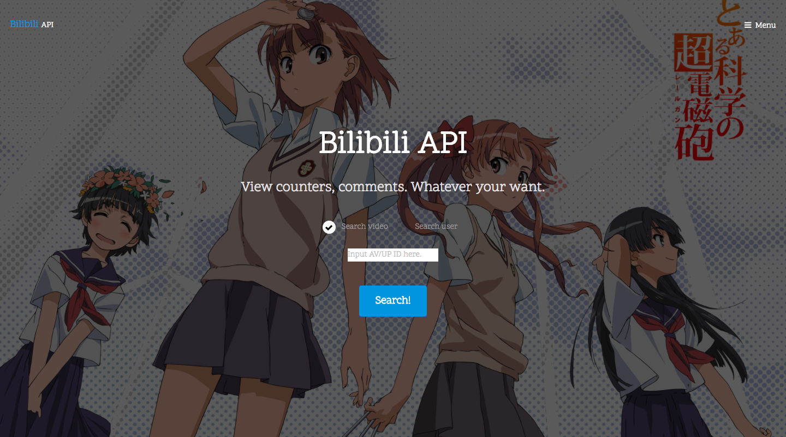
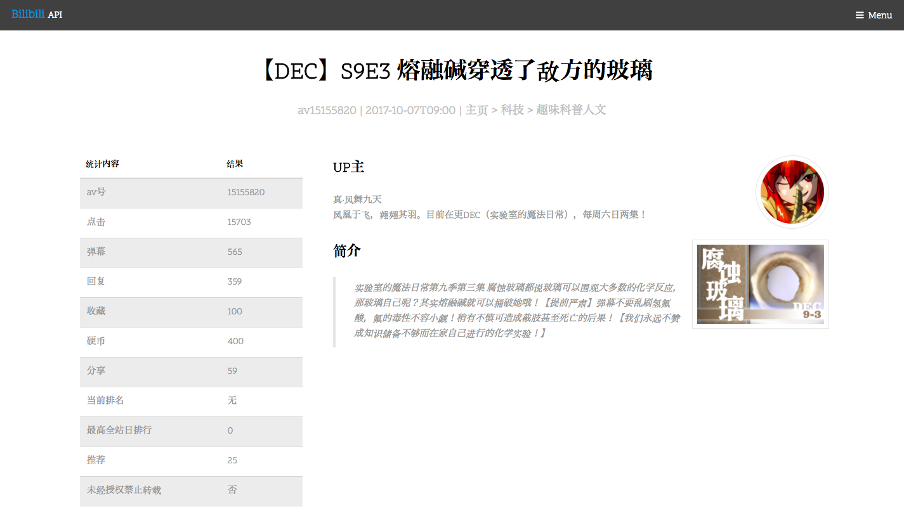

# Bilibili API Development
Using public APIs offered by [bilibili.com](https://bilibili.com "Bilibili"), a famous video website in China, to dynamically gain and analyze data of videos and users. In the index page, you can input an AV number for a video or a user ID for the detailed information of that video or user.
## Abstract
This project consists of two parts:
1. Offer GUI to users to search for information of a specific video or an account. More features are still being added. The GUI is currently a RESTful web application built with Node.js. I intend to build an iOS app to extend this project.
2. Store static information of over 14 million videos obtained in late August 2017 into my database. As a practice of learning database, analyze how MySQL stores and modify them upon changing.
## Getting Started
To run this website on your localhost:
### Prerequisites
* [Node.js](https://nodejs.org/en/).
### Installing
First, install all dependencies using `npm` command.
```
npm install
```
Then, to start the server, run
```
node biliInfo.js
```
Now, the server is listening on `localhost:3002`.
## Develop
For developers, it might be easier to test by running the website using `nodemon`. If you haven't installed it, run
```
npm install -g nodemon
```
Then, to start the server, run
```
nodemon biliInfo.js -e js,html,css
```
The server will restart automatically if any JavaScript, HTML, or CSS has changed.

## Preview
### Index page

### Video information page

## License
[MIT](LICENSE)
